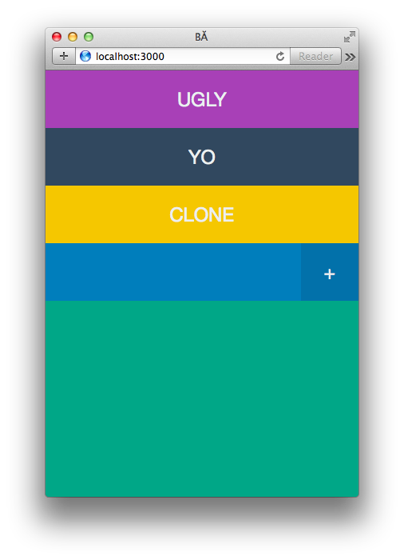

BĂ
===



BĂ is a quick and dirty [Yo](https://itunes.apple.com/us/app/yo./id834335592?mt=8) clone I wrote in about 3 hours. Deployed at [http://ba-dev.herokuapp.com](http://ba-dev.herokuapp.com). Not finished by any degree, but it sorta works.

### Installing

Depends on [Meteor](https://www.meteor.com) and [Meteorite](https://github.com/oortcloud/meteorite/).

```bash
$ https://github.com/tvararu/ba.git
$ cd ba
$ mrt install
$ mrt
```

### License
[MIT](license.txt).
